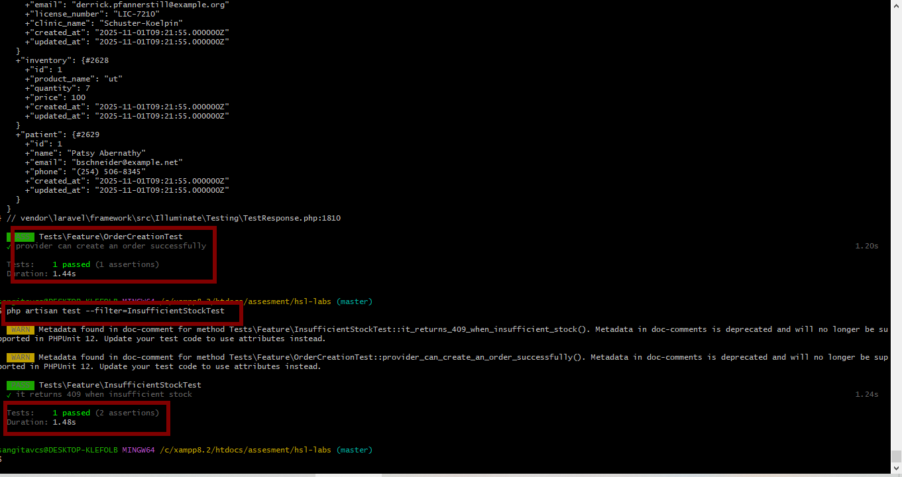

 HSL Labs – Provider Order Management (Laravel Project)

This project is a Laravel-based application used byLicensed Providers (Plastic Surgeons) to order nutritional supplement products for their patients. 

It demonstrates:

- Cleanservice-layer architecture
-Authorization using Laravel Policies
-Event → Listener workflow for email notifications
-Inventory concurrency safety usingDB::transaction() andlockForUpdate()
-Feature test coverage for critical order flows

***************************************************
Requirements

Before installing, ensure you have the following:

| Tool | Version |
|------|---------|
| PHP 8.1+ | Required |
| Composer | Latest |
| MySQL or SQLite | Any |
| Node.js + NPM | Only if compiling front-end assets |
| Git | For version control |

******************************************************

Installation Setup

Clone project (or create new folder and init Git)
git clone <your-repo-url> hsl-labs
cd hsl-labs

Install dependencies
composer install

Setup environment
cp .env.example .env
php artisan key:generate

Configure database in .env

Then edit .env and set your database credentials:

DB_CONNECTION=mysql
DB_HOST=127.0.0.1
DB_PORT=3306
DB_DATABASE=hsl_labs
DB_USERNAME=root
DB_PASSWORD=

Database Setup & Seeders
Create Migrations
php artisan make:migration create_providers_table --create=providers
php artisan make:migration create_patients_table --create=patients
php artisan make:migration create_inventories_table --create=inventories
php artisan make:migration create_orders_table --create=orders
php artisan make:migration create_subscriptions_table --create=subscriptions

Run migrations:

Finally, clear & cache configuration:

php artisan config:clear
php artisan config:cache

| Table | Purpose |
|-------|---------|
|users | Stores login accounts for providers & staff |
|providers | Profile data for Licensed Providers (clinics) |
|patients | Patients who receive products |
|inventories | Product stock + pricing |
|orders | Provider product purchase orders |
Running Migrations
php artisan migrate

******************************************************
Reset DB & Seed Demo Data

---

Domain Flow Summary

Business Flow Summary

1. A Provider logs in (each provider has a connectedUser account).
2. The provider selects a product from Inventory.
3. They place an Order for a patient.
4. The system:
   - Validates input viaStoreOrderRequest
   - Checks stock withlockForUpdate() for concurrency safety
   - Creates the Order inside a DB transaction
   - Decrements product inventory
   - FiresOrderPlaced event
   - Listener sends confirmation email to provider

******************************************************

API Endpoint: Create Order

POST/api/orders

Request Body

json
{
  "provider_id": 1,
  "inventory_id": 1,
  "patient_id": 1,
  "quantity": 2
}
Response
{
  "message": "Order placed successfully!",
  "data": {
    "id": 42,
    "provider_id": 1,
    "inventory_id": 1,
    "patient_id": 1,
    "quantity": 2,
    "total": 200,
    "status": "confirmed"
  }
}{
    "message": "Order placed successfully!",
    "data": {
        "provider_id": 1,
        "patient_id": 1,
        "inventory_id": 1,
        "quantity": 2,
        "total": 255.42,
        "status": "confirmed",
        "updated_at": "2025-10-25T11:48:26.000000Z",
        "created_at": "2025-10-25T11:48:26.000000Z",
        "id": 13,
        "provider": {
            "id": 1,
            "name": "Katrine Pagac V",
            "email": "georgianna93@example.net",
            "clinic_name": "Mosciski, Torphy and Carroll",
            "created_at": "2025-10-25T01:38:08.000000Z",
            "updated_at": "2025-10-25T01:38:08.000000Z"
        },
        "inventory": {
            "id": 1,
            "product_name": "culpa",
            "quantity": 42,
            "price": "127.71",
            "created_at": "2025-10-25T02:10:08.000000Z",
            "updated_at": "2025-10-25T11:48:26.000000Z"
        },
        "patient": {
            "id": 1,
            "name": "Jeromy Kassulke II",
            "email": "ziemann.chelsea@example.org",
            "phone": "254.948.6794",
            "created_at": "2025-10-25T02:24:05.000000Z",
            "updated_at": "2025-10-25T02:24:05.000000Z"
        }
    }
}

******************************************************
Authorization (Policies)
Authorization (Provider-Only Access)

Order creation is protected using Laravel Policies.

Only users withrole = 'provider' are allowed to create orders.

-OrderPolicy.php defines the rules.
- Controller callsauthorize('create', Order::class) to enforce them.

******************************************************
Order Service (Business Logic)

Order creation is handled inapp/Services/OrderService.php using:

-DB::transaction() for atomic execution
-lockForUpdate() to prevent race-condition stock issues
- Automatic inventory decrement
- Event dispatch (OrderPlaced)

******************************************************
Event → Listener → Email

| Component | Purpose |
|----------|---------|
| OrderPlaced | Fired when order is successfully created |
| SendOrderConfirmationEmail | Sends provider confirmation email |
| OrderConfirmationMail | Email template |

This keeps controllers and services clean, and moves side-effects into event listeners.
Automated Tests

Run all tests:

php artisan test

 Continuous Integration (GitHub Actions)

This project includes automated tests that run on every push and pull request.

Setup

Create the workflow file:

 What it does

- Uses PHP 8.2
- Installs Composer dependencies
- Sets up SQLite in-memory test database
- Runs `php artisan test`

This ensures that the codebase stays stable and every commit is tested automatically.

name: Run Tests

on:
  push:
  pull_request:

jobs:
  tests:
    runs-on: ubuntu-latest

    services:
      mysql:
        image: mysql:8.0
        env:
          MYSQL_ROOT_PASSWORD: root
          MYSQL_DATABASE: hsl_labs_test
        ports:
          - 3306:3306
        options: >-
          --health-cmd="mysqladmin ping --silent"
          --health-interval=5s
          --health-timeout=5s
          --health-retries=10

    steps:
      - name: Checkout code
        uses: actions/checkout@v3

      - name: Setup PHP
        uses: shivammathur/setup-php@v2
        with:
          php-version: '8.2'
          extensions: pdo_mysql
          coverage: none

      - name: Install Dependencies
        run: composer install --prefer-dist --no-interaction --no-progress

Ordering more than available stock triggers validation error

Utility Commands
php artisan cache:clear
php artisan config:clear
php artisan route:clear

      - name: Run migrations
        run: php artisan migrate --no-interaction --force

      - name: Run Tests
        run: php artisan test

